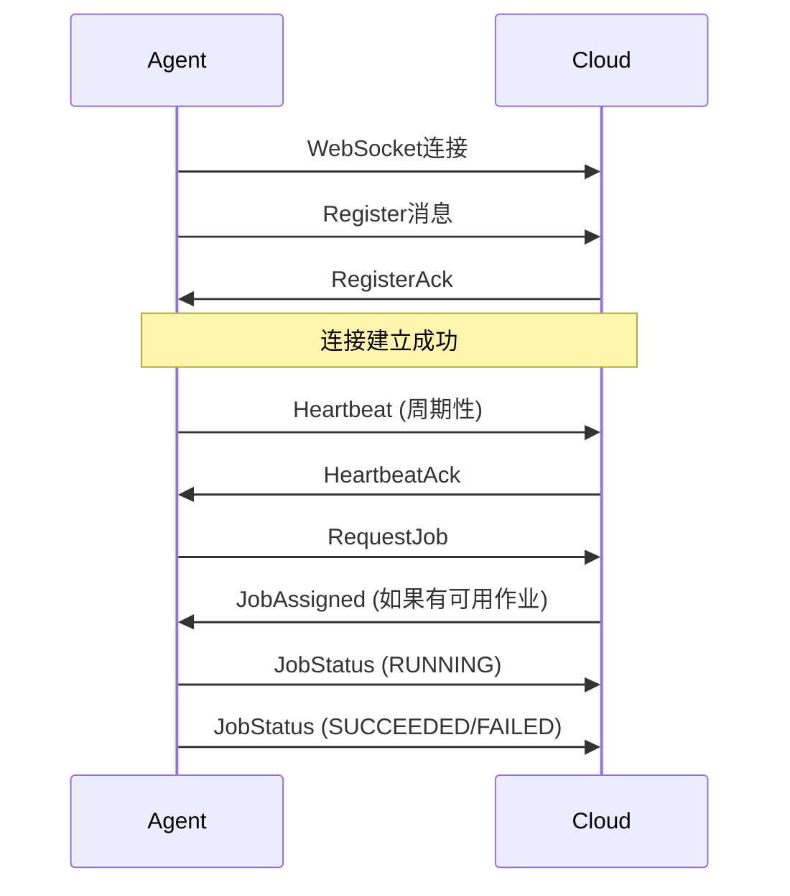
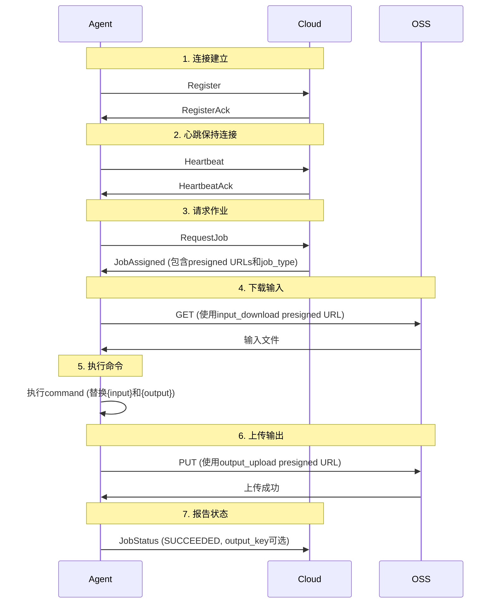

# Cloud-Agent Control Plane Protocol Reference

本文档描述了Cloud服务器与Agent之间的控制平面通信协议。所有通信通过WebSocket (WSS)进行，消息使用Protobuf格式编码。

## 连接信息

- **协议**: WebSocket (WSS in production, WS in dev mode)
- **端点**: `/wss`
- **端口**: 
  - 开发模式: `ws://localhost:8080/wss`
  - 生产模式: `wss://your-domain.com/wss` (端口443)
- **消息格式**: Protobuf (binary)
- **消息封装**: 所有消息使用 `Envelope` 包装

## 安全

- **生产环境**: 必须使用WSS (TLS加密)
- **开发模式**: 可以使用WS (通过 `--dev` 标志)
- **认证**: Agent使用 `agent_id` + `agent_token` (预共享密钥)进行认证

---

## 消息结构

### Envelope (消息封装)

所有消息都包装在 `Envelope` 中，以支持向前兼容性。

```protobuf
message Envelope {
  string agent_id = 1;      // Agent ID (Agent发送的消息必须设置)
  string request_id = 2;    // UUID for tracing
  int64 timestamp = 3;     // Unix milliseconds
  
  oneof payload {
    Register register = 10;
    Heartbeat heartbeat = 11;
    RegisterAck register_ack = 12;
    HeartbeatAck heartbeat_ack = 13;
    RequestJob request_job = 14;
    JobAssigned job_assigned = 15;
    JobStatus job_status = 16;
  }
}
```

**验证规则**:
- 如果payload消息也包含 `agent_id` 字段，它必须等于 `Envelope.agent_id`
- 服务器必须拒绝一致性检查失败的消息

---

## 连接建立流程



---

## Agent -> Cloud 消息

### 1. Register (注册)

Agent连接后首先发送注册消息。

**消息类型**: `Envelope.register`

```protobuf
message Register {
  string agent_id = 1;           // Agent唯一标识符
  string agent_token = 2;        // 预共享密钥 (MVP)
  string hostname = 3;           // 主机名
  int32 max_concurrency = 4;    // 最大并发作业数 (默认1)
}
```

**字段说明**:
- `agent_id`: 必须等于 `Envelope.agent_id`
- `agent_token`: 预共享密钥，用于认证
- `hostname`: Agent所在主机的主机名
- `max_concurrency`: Agent可以同时执行的最大作业数

**响应**: `RegisterAck`

---

### 2. Heartbeat (心跳)

Agent定期发送心跳消息，报告当前状态。

**消息类型**: `Envelope.heartbeat`

**发送频率**: 默认每20秒（可通过 `RegisterAck` 配置）

```protobuf
message Heartbeat {
  string agent_id = 1;        // 必须等于 Envelope.agent_id
  bool paused = 2;            // 是否暂停接受新作业
  int32 running_jobs = 3;     // 当前正在运行的作业数
}
```

**字段说明**:
- `paused`: `true` 表示Agent暂停接受新作业
- `running_jobs`: 当前正在执行的作业数量

**响应**: `HeartbeatAck`

**超时处理**: 如果Agent超过30秒未发送心跳，服务器可能将其标记为离线。

---

### 3. RequestJob (请求作业)

Agent请求分配一个新作业。

**消息类型**: `Envelope.request_job`

```protobuf
message RequestJob {
  string agent_id = 1;              // 必须等于 Envelope.agent_id
  repeated string capabilities = 2; // 可选: Agent能力/标签
  int32 max_concurrency = 3;        // 可选: 最大并发数 (覆盖Register中的值)
}
```

**字段说明**:
- `capabilities`: Agent的能力标签（例如: `["gpu", "python3"]`），用于作业匹配（未来功能）
- `max_concurrency`: 可选，覆盖注册时的并发数

**响应**: 
- 如果有可用作业: `JobAssigned`
- 如果没有可用作业: 无响应（Agent应继续轮询）

**调度规则**:
- 仅当Agent在线、未暂停且有容量时分配作业
- 容量检查: `running_jobs < max_concurrency`
- 优先分配给运行作业最少的Agent

---

### 4. JobStatus (作业状态报告)

Agent报告作业执行状态。

**消息类型**: `Envelope.job_status`

```protobuf
message JobStatus {
  string job_id = 1;              // 作业标识符
  int32 attempt_id = 2;           // 尝试次数
  JobStatusEnum status = 3;       // 当前状态
  string message = 4;             // 可选: 状态消息或错误描述
  string output_key = 5;          // 输出key (可选: 仅stdout时可为空)
  string stdout = 6;              // 命令或本地服务响应(stdout)
  string stderr = 7;              // 命令stderr（失败时常见）
}
```

**状态枚举**:
```protobuf
enum JobStatusEnum {
  JOB_STATUS_UNKNOWN = 0;
  JOB_STATUS_ASSIGNED = 1;    // 已分配 (可选，用于M2+)
  JOB_STATUS_RUNNING = 2;     // 运行中
  JOB_STATUS_SUCCEEDED = 3;    // 成功
  JOB_STATUS_FAILED = 4;       // 失败
  JOB_STATUS_CANCELED = 5;    // 已取消
  JOB_STATUS_LOST = 6;        // 丢失 (Agent断开或租约过期)
}
```

**状态转换**:
- `ASSIGNED` → `RUNNING`: Agent开始执行
- `RUNNING` → `SUCCEEDED`: 执行成功
- `RUNNING` → `FAILED`: 执行失败
- `RUNNING` → `CANCELED`: 被取消
- `RUNNING` → `LOST`: Agent断开或租约过期

**响应**: 无（单向消息）

---

## Cloud -> Agent 消息

### 1. RegisterAck (注册确认)

服务器确认Agent注册。

**消息类型**: `Envelope.register_ack`

```protobuf
message RegisterAck {
  bool success = 1;                    // 注册是否成功
  string message = 2;                  // 消息 (错误时包含错误信息)
  int32 heartbeat_interval_sec = 3;   // 心跳间隔（秒）
}
```

**字段说明**:
- `success`: `true` 表示注册成功
- `message`: 成功或错误消息
- `heartbeat_interval_sec`: 建议的心跳间隔（默认20秒）

**失败处理**: 如果 `success = false`，Agent应断开连接并重试。

---

### 2. HeartbeatAck (心跳确认)

服务器确认收到心跳。

**消息类型**: `Envelope.heartbeat_ack`

```protobuf
message HeartbeatAck {
  bool success = 1;
}
```

**用途**: 确认心跳已收到，Agent保持在线状态。

---

### 3. JobAssigned (作业分配)

服务器分配作业给Agent。

**消息类型**: `Envelope.job_assigned`

```protobuf
message JobAssigned {
  string job_id = 1;                  // 作业UUID
  int32 attempt_id = 2;               // 尝试次数 (从1开始)
  string lease_id = 3;                // 租约ID (保留用于未来租约续期)
  int32 lease_ttl_sec = 4;            // 租约TTL（秒）(保留用于未来)
  
  // 输入下载访问
  OSSAccess input_download = 5;       // Presigned GET URL 或 STS 用于下载输入
  string input_key = 10;              // 输入OSS key (用于提取文件扩展名)
  
  // 输出上传访问
  OSSAccess output_upload = 6;        // Presigned PUT URL 或 STS 用于上传输出
  
  // 输出路径信息
  string output_prefix = 7;           // 输出key前缀 (例如: "jobs/{job_id}/{attempt_id}/")
  string output_key = 8;              // 特定输出key (使用presigned_url时必须设置)
  string command = 9;                 // COMMAND类型时要执行的命令
  JobTypeEnum job_type = 11;          // 作业类型
  ForwardHttpRequest forward_http = 12; // FORWARD_HTTP配置
  InputForwardMode input_forward_mode = 13; // 输入转发方式
}
```

**JobTypeEnum (作业类型)**:
```protobuf
enum JobTypeEnum {
  JOB_TYPE_UNKNOWN = 0;
  JOB_TYPE_COMMAND = 1;       // 执行命令
  JOB_TYPE_FORWARD_HTTP = 2;  // 转发到本地HTTP服务
}
```

**InputForwardMode (输入转发方式)**:
```protobuf
enum InputForwardMode {
  INPUT_FORWARD_MODE_UNSPECIFIED = 0;
  INPUT_FORWARD_MODE_URL = 1;        // 仅传URL给本地服务
  INPUT_FORWARD_MODE_LOCAL_FILE = 2; // 下载文件并转发
}
```

**ForwardHttpRequest (本地转发请求)**:
```protobuf
message Header {
  string key = 1;
  string value = 2;
}

message ForwardHttpRequest {
  string url = 1;              // 本地服务URL
  string method = 2;           // HTTP方法(默认POST)
  repeated Header headers = 3; // 透传请求头
  bytes body = 4;              // 原始body
  int32 timeout_sec = 5;       // 超时(秒)
}
```

**OSSAccess (OSS访问凭证)**:
```protobuf
message OSSAccess {
  oneof auth {
    string presigned_url = 1;  // Presigned URL用于直接访问 (GET用于输入, PUT用于输出)
    STSCreds sts = 2;          // STS临时凭证
  }
}
```

**STSCreds (STS临时凭证)**:
```protobuf
message STSCreds {
  string access_key_id = 1;
  string access_key_secret = 2;
  string security_token = 3;
  string endpoint = 4;         // OSS端点
  string bucket = 5;           // Bucket名称
  int64 expires_at_ms = 6;     // 过期时间戳 (Unix毫秒)
}
```

**验证规则**:
- 如果 `output_upload` 使用 `presigned_url`: `output_key` 必须设置
- 如果 `output_upload` 使用 `sts`: `output_prefix` 必须设置

**命令字段（仅COMMAND）**:
- `command`: 要执行的命令，支持占位符:
  - `{input}`: 输入文件路径（Agent下载后）- **完整文件系统路径**
  - `{output}`: 输出文件路径（Agent应写入此路径）- **完整文件系统路径**
- 示例: `"python C:/scripts/analyze.py {input} {output}"`

**文件路径格式**:
- Windows: `C:\Users\...\AppData\Local\Temp\job_xxx_input.<ext>`
- Linux: `/tmp/job_xxx_input.<ext>`
- Agent会从 `input_key` 中提取文件扩展名并保留在临时文件名中
- 例如: 如果 `input_key = "inputs/image.jpg"`，临时文件将是 `job_xxx_input.jpg`
- 脚本应该直接使用这些路径进行文件操作（读取输入文件，写入输出文件）

**Agent处理流程**:
1. 接收 `JobAssigned` 消息
2. 检查是否可以接受作业（未暂停且有容量）
3. 根据 `job_type` 分支：
   - **COMMAND**:
     1) 从 `input_download` 获取presigned URL，下载输入文件到临时文件  
        - Agent会从 `input_key` 中提取文件扩展名（如果存在）
        - 临时文件名格式: `job_{job_id}_input{.<ext>}`
     2) 创建输出文件路径（临时文件）
     3) 执行 `command`，替换 `{input}` 和 `{output}`
     4) 读取输出文件并上传到 `output_upload`
   - **FORWARD_HTTP**:
     1) 组装HTTP请求（`forward_http`）
     2) `input_forward_mode=URL`: 不下载输入，直接传URL给本地服务
        - Header: `X-Input-URL`, `X-Input-Key`
        - JSON body默认包含 `input_url` / `input_key`（当body为空）
     3) `input_forward_mode=LOCAL_FILE`: 下载输入后以multipart上传
        - 文件字段名: `file`
        - 额外字段: `payload`(可选), `input_url`, `input_key`
     4) 响应body作为输出数据；若有 `output_upload` 则上传
4. 发送 `JobStatus` 报告结果

**Agent与本地服务通讯示例**:

**URL模式（input_forward_mode=URL）**:
```
POST /api/analyze HTTP/1.1
Host: 127.0.0.1:8080
Content-Type: application/json
X-Job-Id: 550e8400-e29b-41d4-a716-446655440000
X-Attempt-Id: 1
X-Input-URL: https://oss.example.com/inputs/job-123/image.jpg?sign=...
X-Input-Key: inputs/job-123/image.jpg

{
  "input_url": "https://oss.example.com/inputs/job-123/image.jpg?sign=...",
  "input_key": "inputs/job-123/image.jpg"
}
```

**本地文件模式（input_forward_mode=LOCAL_FILE）**:
```
POST /api/analyze HTTP/1.1
Host: 127.0.0.1:8080
Content-Type: multipart/form-data; boundary=----boundary
X-Job-Id: 550e8400-e29b-41d4-a716-446655440000
X-Attempt-Id: 1

------boundary
Content-Disposition: form-data; name="file"; filename="image.jpg"
Content-Type: application/octet-stream

<file-bytes>
------boundary
Content-Disposition: form-data; name="input_key"

inputs/job-123/image.jpg
------boundary
Content-Disposition: form-data; name="input_url"

https://oss.example.com/inputs/job-123/image.jpg?sign=...
------boundary--
```

**本地服务响应**:
- Agent将响应body作为输出数据；若存在 `output_upload`，会上传并在 `JobStatus` 中带上 `output_key`

**脚本编写要求**:
- 输入: 从 `{input}` 参数（文件路径）读取输入文件
- 输出: 将结果写入 `{output}` 参数（文件路径）
- 如果输出文件不存在，Agent会尝试使用命令的stdout作为输出

---

## 消息流程示例

### 完整作业执行流程



---

## 错误处理

### Agent端错误

1. **命令执行失败**
   - Agent发送 `JobStatus`，`status = FAILED`
   - `message` 字段包含错误信息

2. **下载输入失败**
   - Agent发送 `JobStatus`，`status = FAILED`
   - `message` 字段包含下载错误信息

3. **上传输出失败**
   - Agent发送 `JobStatus`，`status = FAILED`
   - `message` 字段包含上传错误信息

4. **命令超时**
   - Agent命令执行超时（默认30分钟）
   - Agent发送 `JobStatus`，`status = FAILED`
   - `message` 字段包含超时信息

### Cloud端错误

1. **注册失败**
   - `RegisterAck.success = false`
   - `RegisterAck.message` 包含错误信息
   - Agent应断开连接并重试

2. **作业分配失败**
   - 如果Agent无法接受作业（暂停或达到容量），Agent应发送 `JobStatus`，`status = FAILED`

---

## 实现细节

### Agent实现要求

1. **连接管理**
   - 维护持久的WebSocket连接
   - 自动重连机制（连接断开时）
   - 处理网络中断

2. **心跳机制**
   - 按照 `RegisterAck` 中的 `heartbeat_interval_sec` 发送心跳
   - 如果超过30秒未收到 `HeartbeatAck`，考虑重连

3. **作业执行**
   - 下载输入到临时文件
   - 执行命令，替换占位符
   - 读取输出文件并上传
   - 清理临时文件

4. **并发控制**
   - 跟踪 `running_jobs` 计数
   - 仅在 `running_jobs < max_concurrency` 时接受新作业
   - 在 `Heartbeat` 中报告准确的 `running_jobs` 值

### Cloud实现要求

1. **消息验证**
   - 验证 `Envelope.agent_id` 与payload中的 `agent_id` 一致性
   - 验证Agent已注册
   - 验证作业状态转换的合法性

2. **调度逻辑**
   - 仅分配作业给在线、未暂停且有容量的Agent
   - 优先分配给运行作业最少的Agent
   - 处理Agent断开连接的情况

3. **租约管理** (未来功能)
   - 跟踪作业租约
   - 处理租约过期
   - 支持租约续期

---

## 消息大小限制

- **控制平面消息**: 所有消息必须小（< 1MB）
- **数据平面**: 大文件必须通过OSS传输，不能通过WebSocket

---

## 向前兼容性

- 服务器必须容忍未知字段（Protobuf的默认行为）
- 新字段应使用可选类型
- Agent应忽略未知的消息类型

---

## 示例代码

### Agent发送Register消息

```go
envelope := &control.Envelope{
    AgentId:   "agent-001",
    RequestId: generateRequestID(),
    Timestamp: time.Now().UnixMilli(),
    Payload: &control.Envelope_Register{
        Register: &control.Register{
            AgentId:        "agent-001",
            AgentToken:     "pre-shared-token",
            Hostname:       "WORKSTATION-01",
            MaxConcurrency: 1,
        },
    },
}

data, _ := proto.Marshal(envelope)
conn.WriteMessage(websocket.BinaryMessage, data)
```

### Agent处理JobAssigned消息

```go
func handleJobAssigned(assigned *control.JobAssigned) {
    // 1. 获取输入presigned URL
    inputURL := assigned.InputDownload.GetPresignedUrl()
    
    // 2. 下载输入文件
    inputFile := downloadToFile(inputURL)
    
    // 3. 替换占位符并执行命令
    command := strings.ReplaceAll(assigned.Command, "{input}", inputFile)
    command = strings.ReplaceAll(command, "{output}", outputFile)
    executeCommand(command)
    
    // 4. 上传输出
    outputURL := assigned.OutputUpload.GetPresignedUrl()
    uploadFile(outputFile, outputURL)
    
    // 5. 报告成功
    reportJobStatus(assigned.JobId, SUCCEEDED, assigned.OutputKey)
}
```

---

## 注意事项

1. **命令执行**: Agent必须执行 `command` 字段中的命令。如果命令为空，Agent应返回 `FAILED` 状态。

2. **占位符替换**: Agent必须将 `{input}` 和 `{output}` 替换为实际文件路径。

3. **输出文件**: Agent执行命令后，必须将输出写入 `{output}` 指定的文件。如果文件不存在，Agent可以使用stdout作为输出。

4. **临时文件清理**: Agent应在作业完成后清理所有临时文件。

5. **超时控制**: Agent应实现命令执行超时（建议30分钟）。

6. **错误报告**: 所有错误都应通过 `JobStatus` 消息报告，包含详细的错误信息。
